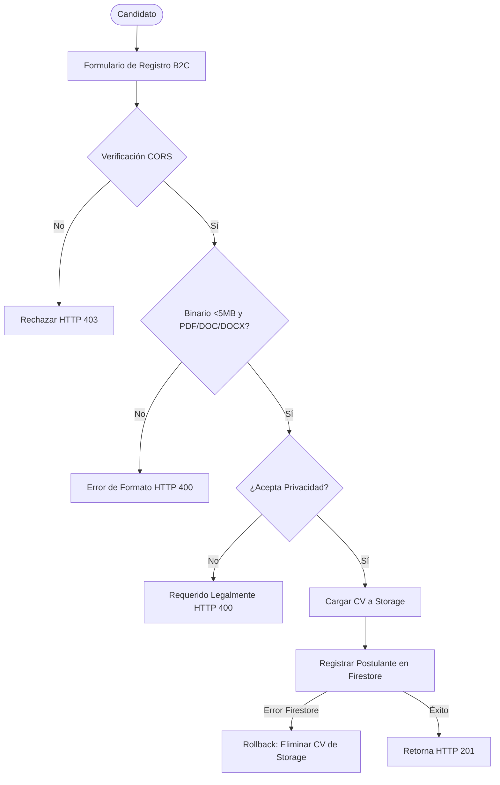
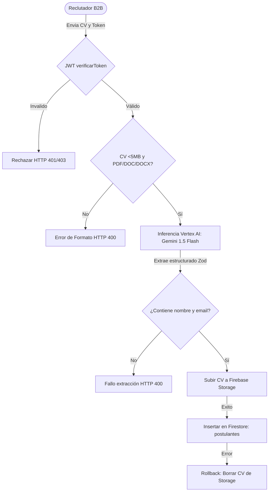
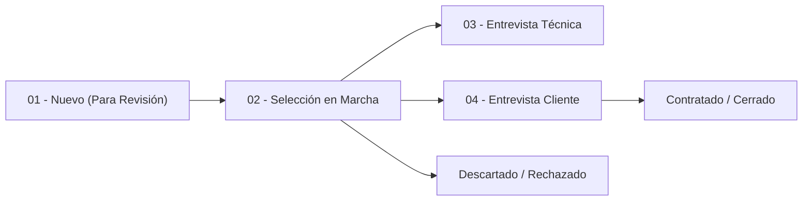

# Explicación Funcional del Servicio de Postulantes, Búsquedas y Pipeline (Talent Mixer)

Este documento detalla el funcionamiento lógico, los flujos de negocio, los esquemas de persistencia y las reglas de seguridad aplicadas en los módulos de **Postulantes (candidatos)**, **Búsquedas (vacantes)** y **Pipeline de Entrevistas** en el ecosistema backend de la plataforma Azul ATS.

---

## 1. Introducción y Objetivo General
El microservicio centraliza el reclutamiento y la selección de personal a través de tres pilares transaccionales robustos:
*   **Captación de Talentos (B2C & B2B):** Permite el registro de candidatos a través de la Landing Page con validación de privacidad RGPD, carga de CVs adjuntos a Firebase Storage y administración de perfiles.
*   **Gestión de Búsquedas (B2B):** Administra el catálogo de vacantes y requisitos técnicos del negocio organizados en un esquema anidado estricto en Firestore.
*   **Pipeline de Entrevistas (Kanban B2B):** Actúa como el vínculo conector N-N entre vacantes y candidatos, permitiendo monitorear el progreso de cada postulación, almacenar evaluaciones analíticas de Gemini AI, registrar feedback técnico y gestionar los descartes o contrataciones finales.

---

## 2. Flujo Funcional del Candidato (B2C: Portal Público)

El registro de candidatos espontáneos sigue una arquitectura secuencial blindada ante fallos en la nube:



### Reglas Funcionales de Postulantes:
1.  **Formato e Integridad:** Solo se admiten archivos adjuntos `.pdf`, `.doc` y `.docx` con peso máximo de 5MB.
2.  **Consentimiento de Privacidad (RGPD):** Es obligatorio marcar `acepta_privacidad: true` para poder persistir la información.
3.  **Bucle de Rollback (Mecanismo Antihuérfanos):** Si la base de datos Firestore falla tras subir el CV a Google Cloud Storage, el microservicio borra de inmediato el archivo en la nube para evitar fugas financieras y archivos huérfanos.
4.  **Campos de Perfil:**
    *   `telefono_movil`: Teléfono móvil (admite null o vacío).
    *   `ubicacion`: Ciudad y país (admite null o vacío).
    *   `skills_principales`: Cadena de 3 a 5 palabras clave separadas por comas (validación estricta).
    *   `nivel_ingles`: Nivel del idioma inglés (texto libre).
    *   `otros_idiomas`: Otros idiomas o dialectos.
    *   `notas_iniciales`: Trazabilidad o apuntes preliminares.
---

## 2.1 Flujo Funcional de Importación por IA (B2B: Módulo de Importación Interna)

El proceso de importación automatizada a través de IA orquesta una arquitectura transaccional de extracción estructurada, optimizando la captura de talento desde backoffice:



### Reglas Específicas de la Importación por IA:
1. **Seguridad Exclusiva B2B:** Protegido por el middleware `verificarToken`. Solo usuarios y servicios B2B autenticados pueden consumir este endpoint.
2. **Inferencia Asistida (Genkit + Zod):** Utiliza **Firebase Genkit** con la API nativa de **Google Vertex AI** para invocar a `gemini-1.5-flash`. Se define un esquema de Zod estricto para recuperar un JSON estructurado con los campos del candidato.
3. **Cruzamiento y Relleno de Datos en Firestore:**
   * `id`: UUID autogenerado en backend.
   * `url_cv`: URI canónica `gs://` del bucket.
   * `origen`: Forzado a `"importacion_ia"`.
   * `estado_revision`: Forzado a `"pendiente"`.
   * `acepta_privacidad`: Forzado a `true` (asumiendo consentimiento pre-validado por el reclutador).
   * `skills_principales`: Cadena de 3 a 5 palabras clave separadas por comas (validadas si lo devuelve la inferencia).
4. **Mecanismo de Rollback Físico:** Al igual que el registro público, en caso de fallar la escritura final en Firestore, se ejecuta la eliminación inmediata del binario cargado en Firebase Storage para garantizar la integridad e higiene del almacenamiento.

---

## 3. Módulo de Búsquedas (Vacantes)

El catálogo de búsquedas y requerimientos operativos se estructura bajo un diseño de **4 bloques jerárquicos**. A partir de las últimas mejoras, se ha suspendido la replicación hacia BigQuery, actuando **Firestore** como única fuente de verdad transaccional.

### Esquema de Datos de Búsquedas:
*   `id_busqueda`: ID descriptivo o código único (ej. `REQ-MOCK-001`). Si no es proveído, toma el ID autogenerado del documento de Firestore.
*   `identificacion`:
    *   `cliente` (Obligatorio)
    *   `hiring_manager`
    *   `fecha_apertura`
*   `perfil_tecnico`:
    *   `rol_solicitado` (Obligatorio)
    *   `seniority`
    *   `skills_excluyentes` (Array)
    *   `skills_deseables` (Array)
    *   `nivel_ingles_req`
*   `condiciones`:
    *   `modalidad` (Presencial, Remoto, Híbrido)
    *   `zona_horaria_ubicacion`
*   `estado_sla`:
    *   `presupuesto_max`
    *   `estado_busqueda` (Obligatorio, ej. `Abierta`, `Pausada`, `Cerrada`)
    *   `prioridad` (ej. `Baja`, `Normal`, `Alta`, `Crítica`)
    *   `link_job_description`

### Control de Modificación de Búsquedas:
Para salvaguardar la estructura de la vacante aprobada por finanzas, el endpoint `PATCH /api/v1/busquedas/:id` restringe la edición únicamente a:
1.  `estado_busqueda`
2.  `prioridad`

Estas propiedades pueden actualizarse enviándose al nivel de la raíz o empaquetadas en un objeto `estado_sla`. Cualquier intromisión de otros campos devolverá `HTTP 400 Bad Request`.

---

## 4. Módulo Pipeline de Entrevistas (Vínculo Conector)

El módulo de Pipeline es una **colección puente N-to-N** (`pipeline_entrevistas`) que asocia postulantes con búsquedas. Representa el flujo Kanban en el que un candidato transita desde su descubrimiento inicial hasta las calificaciones de entrevistas y el cierre.



### Estructura de Persistencia en `pipeline_entrevistas`:
```json
{
  "id": "e44c2079-c5c8-4a92-bf32-90177dfc8aa0",
  "claves_conexion": {
    "id_busqueda": "REQ-PIPE-TEST",
    "id_candidato": "CAND-UUID-12345"
  },
  "flujo": {
    "estado_actual": "01 - Nuevo (Para Revisión)",
    "fecha_ultimo_cambio": "2026-07-20T16:00:00.000Z",
    "historial_estados": [
      { "estado": "01 - Nuevo (Para Revisión)", "timestamp": "2026-07-20T16:00:00.000Z" }
    ]
  },
  "f1_descubrimiento": {
    "analisis_semantico": {
      "origen": "✨ GEMINI LIVE",
      "fit_score": 95,
      "fortalezas": ["Node.js", "Jest"],
      "debilidades": ["AWS"],
      "recomendaciones": "Avanzar a fase técnica"
    },
    "outreach": {
      "variante_enviada": "Email A",
      "fecha_envio": "2026-07-20T16:05:00.000Z"
    }
  },
  "evaluacion": {
    "puntaje_tecnico": 90,
    "feedback_cliente": "Sólida arquitectura y fit de equipo"
  },
  "cierre": {
    "fecha_cierre": null,
    "motivo_rechazo": null
  },
  "createdAt": "2026-07-20T16:00:00.000Z",
  "updatedAt": "2026-07-20T16:00:00.000Z"
}
```

### Lógica de Negocio y Ciclo de Vida:
*   **Asociación Segura:** Para crear un registro en el pipeline (`POST /api/v1/pipeline`), el backend valida que la búsqueda y el candidato existan en Firestore. Si no existen, retorna `HTTP 404`. Se bloquea la duplicidad (no se permite vincular el mismo par múltiples veces en el pipeline).
*   **Historial de Flujo:** Cada modificación al estado Kanban (mediante `PATCH /api/v1/pipeline/:id`) registra la transición, guarda la marca temporal de la fecha de cambio e inyecta un nuevo registro al array de `historial_estados` para auditoría posterior del SLA.
*   **Evaluación y Cierre Múltiple:** El endpoint `PATCH` acepta modificaciones dinámicas y seguras sobre los bloques `evaluacion` y `cierre` (tales como `puntaje_tecnico`, `feedback_cliente`, `fecha_cierre` y `motivo_rechazo`). Esto le otorga al reclutador la capacidad de calificar y/o desestimar perfiles desde una interfaz integrada.
*   **Desvinculación Física:** El endpoint `DELETE /api/v1/pipeline/:id` elimina la relación establecida en el pipeline sin alterar ni purgar a los postulantes maestros ni a las búsquedas aprobadas del negocio.

---

## 5. Referencia Técnica de APIs Disponibles (Catálogo de Endpoints)

### A. Candidatos (`/api/v1/candidatos`)
*   `POST /api/v1/candidatos` (Público, CORS activo): Registra un postulante enviando el binario `cv` (PDF/DOC/DOCX, <5MB) mediante formulario `multipart/form-data`.
*   `POST /api/v1/candidatos/importar-ia` 🔒 (JWT requerido): Endpoint administrativo B2B para importar y extraer de forma estructurada un currículum usando Gemini 1.5 Flash. Retorna el objeto del candidato creado (HTTP 201).
*   `GET /api/v1/candidatos` 🔒 (JWT requerido): Consulta postulantes filtrados opcionalmente por `estado_revision` y ordenados de forma descendente por `createdAt`.
*   `PATCH /api/v1/candidatos/:id` 🔒 (JWT requerido): Modifica datos de contacto o estado técnico del perfil. Protegido contra modificación de campos inmutables.
*   `DELETE /api/v1/candidatos/:id` 🔒 (SuperAdmin; Comentado en Código): Purga física del candidato y su archivo de GCS.

### B. Búsquedas (`/api/v1/busquedas`)
*   `POST /api/v1/busquedas` 🔒 (JWT requerido): Crea una nueva búsqueda utilizando el esquema jerárquico de 4 bloques. Escribe únicamente en Firestore.
    *   Ejemplo de payload:
    ```json
    {
      "id_busqueda": "REQ-MOCK-001",
      "identificacion": { "cliente": "Azul ATS", "hiring_manager": "Sofia M." },
      "perfil_tecnico": { "rol_solicitado": "React Dev Senior", "seniority": "Senior" },
      "estado_sla": { "estado_busqueda": "Abierta" }
    }
    ```
*   `GET /api/v1/busquedas` 🔒 (JWT requerido): Recupera el catálogo general de búsquedas desde Firestore.
*   `PATCH /api/v1/busquedas/:id` 🔒 (JWT requerido): Permite actualizar únicamente `estado_busqueda` y `prioridad`.

### C. Pipeline (`/api/v1/pipeline`)
*   **POST /api/v1/pipeline** 🔒 (JWT requerido): Vincula un candidato con una búsqueda.
    *   Ejemplo de payload:
    ```json
    {
      "id_busqueda": "REQ-PIPE-TEST",
      "id_candidato": "candidato-uuid-v4-123"
    }
    ```
*   **GET /api/v1/pipeline** 🔒 (JWT requerido): Recupera el tablero de un requerimiento.
    *   Query parameters obligatorios: `id_busqueda` (ej: `?id_busqueda=REQ-PIPE-TEST`).
    *   Query parameters opcionales: `estado_actual` para fases Kanban.
*   **PATCH /api/v1/pipeline/:id** 🔒 (JWT requerido): Actualiza un canal del pipeline.
    *   Ejemplo de payload (Cambiar estado, insertar análisis del modelo IA de Gemini y evaluar cliente):
    ```json
    {
      "estado_actual": "02 - Selección en Marcha",
      "analisis_semantico": {
        "origen": "✨ GEMINI LIVE",
        "fit_score": 95,
        "fortalezas": ["Node.js", "GCP"],
        "debilidades": ["AWS"],
        "recomendaciones": "Avanzar a fase de entrevista técnica"
      },
      "evaluacion": {
        "puntaje_tecnico": 90,
        "feedback_cliente": "Candidato óptimo tras prefiltración"
      }
    }
    ```
*   **DELETE /api/v1/pipeline/:id** 🔒 (JWT requerido): Remueve la ficha de relación del pipeline.
