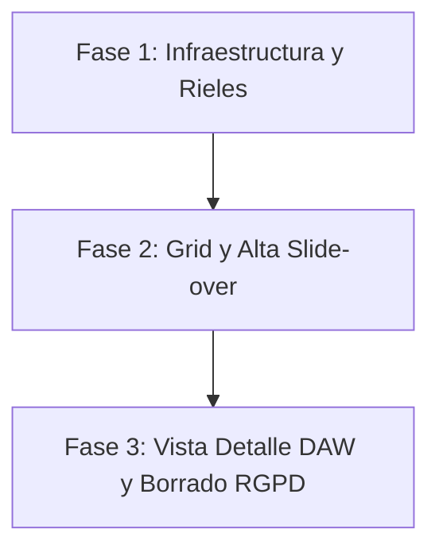

# Plan de Implementación - Módulo Talent Mixer - Azul ATS

El objetivo es desarrollar el módulo **Talent Mixer (Postulantes)** en el frontend de **Azul ATS**, dividido en **3 fases independientes de entrega**. Cada fase permite verificar el comportamiento funcional individualmente y documentarlo. Soportaremos un **Mock Fallback (local fallback data)** para pruebas locales fluidas previas a la disponibilidad final del backend.

---

## User Review Required

> [!IMPORTANT]
> **Ruta y Protección Middleware (`src/proxy.ts`):**
> Incorporaremos `/talento` en la lista de rutas restringidas del proxy perimetral de Edge y en el middleware matcher de Next.js para obligar redirecciones a login de usuarios sin autenticar.
>
> **Esquema de Datos Mockeado Temporal:**
> La infraestructura usará un set local simulado si el backend real en Cloud Run no responde o si estamos en modo Demo. Esto permite un flujo CRUD completo para pruebas en cliente.
> *   *Regla Técnica de Datos Simulados:* Los objetos candidatos y las respuestas de creación mockeadas **siempre tendrán `acepta_privacidad: true`** para evitar bloqueos por validación de privacidad rigurosa en el cliente.
>
> **Estrategia Dual de Borrado (RGPD):**
> *   **Soft Delete:** Un reclutador en la vista de detalle cambia el estado a `"Descartado"`.
> *   **Hard Delete:** El Super Admin en `/configuracion` borra físicamente el PDF de Storage y luego el registro de la DB.

---

## Estructura de Fases de Desarrollo

---

## Proposed Changes

---

### FASE 1: Infraestructura de Datos, Rutas del Edge y Navegación Consistente
*Objetivo:* Proteger la nueva ruta `/talento`, coordinar el ruteador de la aplicación con la API de candidatos provista de Mock Fallback e integrar enlaces de navegación globales coherentes.

#### [MODIFY] [proxy.ts](file:///Users/dcastellano/Documents/devs/da-rh1/azulats-app1/src/proxy.ts)
*   Modificar regla de verificación agregando la protección perimetral a `/talento`.
*   Actualizar `config.matcher` para que incluya `"/talento/:path*"`.

#### [NEW] [candidatos.ts](file:///Users/dcastellano/Documents/devs/da-rh1/azulats-app1/src/actions/candidatos.ts)
*   Implementar métodos REST hacia la API de Cloud Run `api/v1/candidatos`: `getCandidatosAPI()`, `crearCandidatoAPI()`, `actualizarCandidatoAPI()`, `eliminarCandidatoAPI()`.
*   Añadir control de contingencias (Mock Fallback / Local Database): Si la consulta real de red a Cloud Run no responde (o está en modo demo), las acciones se resolverán transparentemente usando un array de candidatos en memoria (`sessionStorage` o persistencia simulada de alta fidelidad) con fotos y perfiles orientados a España.
*   **Confirmación del Mock:** Asegurar que todos los candidatos simulados y las respuestas exitosas de simulación tengan e inyecten por defecto el campo `acepta_privacidad: true`.

#### [MODIFY] [page.tsx](file:///Users/dcastellano/Documents/devs/da-rh1/azulats-app1/src/app/dashboard/page.tsx)
#### [MODIFY] [page.tsx](file:///Users/dcastellano/Documents/devs/da-rh1/azulats-app1/src/app/busquedas/page.tsx)
#### [MODIFY] [page.tsx](file:///Users/dcastellano/Documents/devs/da-rh1/azulats-app1/src/app/reclutamiento/page.tsx)
#### [MODIFY] [page.tsx](file:///Users/dcastellano/Documents/devs/da-rh1/azulats-app1/src/app/configuracion/page.tsx)
*   **Enrutamiento Consistente:** Añadir el enlace/botón navegable correspondiente para acceder al módulo `/talento` (Talent Mixer) en el menú/barra de navegación superior de **todas** estas páginas para mantener un esquema de navegación horizontal fluido y universal en toda la aplicación.

#### Verificación e Integración (Fase 1)
*   **Automatización:** Validaciones estáticas de TypeScript sobre la integridad del archivo `candidatos.ts`.
*   **Prueba Manual:** 
    1. Intentar acceder a `/talento` sin cookie de autenticación. Confirmar redirección automática a `/login`.
    2. Iniciar sesión y validar que las URLs de navegación superior carguen correctamente sin provocar excepciones.
*   **Documentación:** Registrar la estructura del conector `src/actions/candidatos.ts` y del proxy de seguridad en el archivo `README.md`.

---

### FASE 2: Interfaz de Grilla de Talentos y Slide-over de Registro
*Objetivo:* Crear la interfaz gráfica del mixer de talentos a pantalla completa y el formulario de alta manual con arrastre de ficheros adjuntos.

#### [NEW] [page.tsx](file:///Users/dcastellano/Documents/devs/da-rh1/azulats-app1/src/app/talento/page.tsx)
*   **Layout:** Vista de 4 columnas (Grid) con tarjetas de candidatos *glassmorphism* (Stitch Style: hover traslúcido, bordes difusos, elevación).
*   **Filtros:** Barra superior con motor de búsqueda reactivo y filtro por estado de revisión (`Todos`, `Pendiente`, `Revisado`, `Descartado`, `Seleccionado`).
*   **Componente Alta de Postulante:** Slide-over interactivo con formulario:
    *   Campos flotantes: Nombre, Email, Puesto, LinkedIn.
    *   **Dropzone de CV:** Validador web reactivo para PDF limitando la carga a un peso de archivo `<5MB`.
    *   **Aceptación Legal:** Checkbox personalizado para la LOPDGDD.
    *   **Manejo de Errores de API:** El componente Alta Manual debe capturar, procesar y mostrar alertas/mensajes de error explícitos en pantalla si la llamada al backend real o mocked falla con un código HTTP 400 Bad Request (campos vacíos, archivo corrupto o inválido).
    *   **Acciones:** Cancelar y Guardar con actualización optimista de la grilla de candidatos.

#### Verificación e Integración (Fase 2)
*   **Automatización:** Validar mediante pruebas locales que al ingresar un correo inválido o un archivo que supere el tamaño límite (ej: 6MB) en el formulario, se lancen notificaciones de error visibles y se detenga la subida.
*   **Prueba Manual:**
    1. Arrastrar un archivo PDF válido al Dropzone, rellenar el formulario de alta y guardarlo. El nuevo candidato debe renderizarse instantáneamente en el primer puesto de la grilla con el estado `PENDIENTE`.
    2. Probar los filtros de búsqueda escribiendo el nombre de algún candidato y alternando el estado de revisión.
*   **Documentación:** Actualizar `README.md` sección "Maestro de Talentos" indicando cómo subir candidatos y las reglas de validación en cliente.

---

### FASE 3: Vista de Detalle DAW, Acciones de Borrado (Soft/Hard Delete RGPD)
*Objetivo:* Implementar la vista del candidato simulando la consola de audio MIDI, el descarte diario para reclutadores y la Danger Zone exclusiva para el Super Administrador.

#### [NEW] [id]/page.tsx](file:///Users/dcastellano/Documents/devs/da-rh1/azulats-app1/src/app/talento/[id]/page.tsx)
Vista a nivel de ficha detallada del postulante:
*   **Layout DAW:**
    *   *Panel Izquierdo:* Ficha de perfil clásico, email, puesto y un selector interactivo del estado de revisión conteniendo el indicador luminoso reactivo en la esquina. Botón de acceso directo para abrir el CV PDF (`window.open`).
    *   *Panel Derecho (Faders MIDI):* Maquetación grayscale y translúcida (Fase 1 / opacidad) del ecualizador visual de habilidades analizadas por IA (*Hard Skills, Soft Skills, Fit Cultural, Seniority*).
*   **Botón Soft Delete (Operativo):** Permite cambiar el estado del postulante a `"Descartado"` desde la vista de detalle.

#### [MODIFY] [page.tsx](file:///Users/dcastellano/Documents/devs/da-rh1/azulats-app1/src/app/configuracion/page.tsx)
*   Añadir sección condicionada por rol (`user.rol === "Super Administrador"`): **"Derecho al Olvido (Danger Zone / RGPD)"**.
*   Mostrar tabla simplificada de la base de candidatos.
*   Botón "Eliminar Permanentemente (Hard Delete)" que invoca a `eliminarCandidatoAPI(id, true)` con un modal táctil de confirmación de doble paso.

#### Verificación e Integración (Fase 3)
*   **Tareas Manuales del Usuario:**
    *   Configurar si es necesario la variable `NEXT_PUBLIC_API_URL` en el archivo `.env.local` con la ruta del backend real: `https://api-azulats-yur42lfa-ew.a.run.app`.
*   **Automatización:** Comprobar la lógica de discriminación de roles para el borrado perimetral: verificar que el inicio de sesión de un reclutador devuelva `null` o bloquee el acceso/visualización a la grilla de Danger Zone en configuración.
*   **Prueba Manual:**
    1. Modificar el estado de revisión de un candidato de `Pendiente` a `Seleccionado`. El color de la esfera luminosa pulsante debe cambiar reactivamente.
    2. Como Super Administrador, realizar un Hard Delete de un candidato en configuración. Validar que desaparezca por completo del listado en `/talento`.
*   **Documentación:** Registrar en el archivo `README.md` el esquema de borrado dual (Soft vs Hard Delete) y las consideraciones reglamentarias de cumplimiento LOPDGDD.
