# Manual Funcional: Plataforma de Reclutamiento Azul ATS

Este documento proporciona una explicación funcional y visual a nivel de negocio y técnico de cada una de las pantallas de **Azul ATS**, diseñadas con el sistema premium de diseño glassmorphism de Stitch.

Las imágenes correspondientes de cada pantalla han sido guardadas en esta misma carpeta (`docs/`) para su referencia.

---

## 🧭 Índice de Módulos
1. [Módulo A: Portal de Inicios de Sesión (Login)](#1-módulo-a-portal-de-inicios-de-sesión)
2. [Módulo B: Dashboard Gerencial](#2-módulo-b-dashboard-gerencial)
3. [Módulo C: Maestro de Búsquedas (Gestión de Posiciones)](#3-módulo-c-maestro-de-búsquedas)
4. [Módulo C.1: Slide-over de Alta y Edición de Búsquedas](#31-slide-over-de-alta-y-edición-de-búsquedas)
5. [Módulo D: Recruitment Management (Tablero Kanban)](#4-módulo-d-recruitment-management-tablero-kanban)
6. [Módulo E: Ajustes y Configuración del Sistema (Incluye Zona de Peligro RGPD)](#5-módulo-e-ajustes-y-configuración-del-sistema)
7. [Módulo F: Postulantes (Maestro y Registro de Candidatos)](#6-módulo-f-postulantes-maestro-y-registro-de-candidatos)
8. [Módulo F.1: Ficha de Postulante y Consola DAW (Faders de IA)](#61-ficha-de-postulante-y-consola-daw-faders-de-ia)
9. [Módulo G: F1 Descubrimiento (Tablero Kanban y Lista de Sourcing)](#7-módulo-g-f1-descubrimiento)
10. [Módulo G.1: Ficha de Candidato en F1 Descubrimiento y Motores de IA Google Gemini](#71-ficha-de-candidato-en-f1-descubrimiento-y-motores-de-ia-google-gemini)

---

## 1. Módulo A: Portal de Inicios de Sesión

### 📸 Imagen de Referencia: `login_page.png`

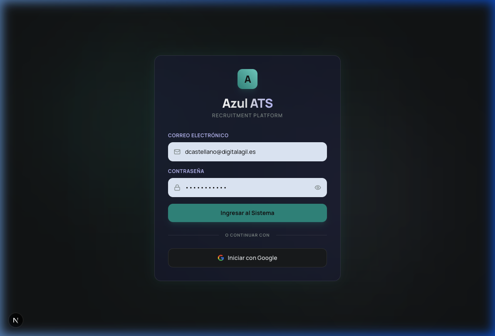

```
Ficha Técnica:
- Ruta: /login
- Tecnología de Seguridad: Firebase Client Authentication
- Acceso: Email/Contraseña + Google OAuth
```

### 💡 Descripción Funcional
El **Portal de Inicios de Sesión** es la puerta de entrada segura al sistema. Ofrece un diseño glassmórfico de alto nivel visual que impresiona al usuario inicial con contrastes sutiles y efectos de iluminación radiales que responden dinámicamente al fondo del espacio de trabajo.

### ✨ Características Clave
*   **Inicio de Sesión por Credentials:** Campos para correo electrónico (`email`) y contraseña (`password`) con toggle interactivo para ver/ocultar los caracteres del password.
*   **Autenticación Social (Google OAuth):** Botón estilizado diseñado bajo los lineamientos corporativos para registrarse de manera directa utilizando cuentas de Google Workspace.
*   **Diseño Premium Estetizado:** Utiliza un contenedor principal traslúcido (glassmorphism panel) con bordes suaves que resalta frente al fondo `#101415`.

---

## 2. Módulo B: Dashboard Gerencial

### 📸 Imagen de Referencia: `dashboard_page.png`

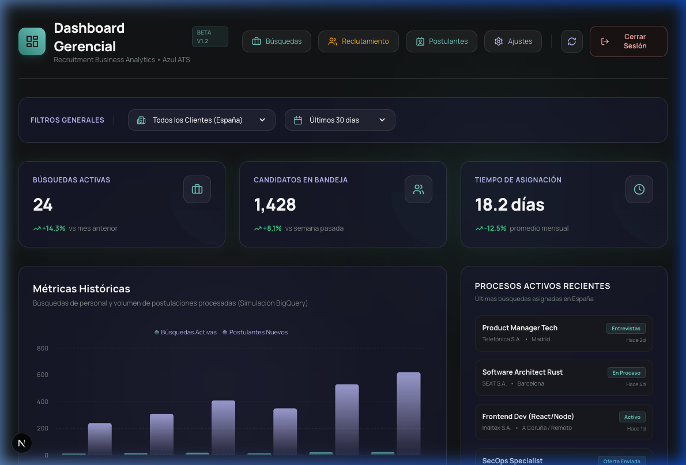

```
Ficha Técnica:
- Ruta: /dashboard
- Acceso: Protegido (Filtra usuarios no autenticados en Edge + Cliente)
- Librería de Gráficos: Recharts
```

### 💡 Descripción Funcional
El **Dashboard Gerencial** sirve como un centro de mando analítico enfocado en la toma de decisiones. Ofrece información global sobre el estado de las búsquedas en curso y la distribución regional dentro del mercado laboral en España.

### ✨ Características Clave
*   **Barra de Filtros Generales:** Ubicada en la parte superior para segmentar las estadísticas según el cliente (ej. Telefónica, Santander, SEAT, Inditex) y rangos de fecha predefinidos (últimos 7 días, 30 días, año en curso).
*   **KPI Cards:** Cuatro tarjetas translúcidas con indicadores numéricos de gran escala que resumen el volumen total de búsquedas activas, postulantes en el embudo, y el lead-time promedio de contratación.
*   **Analíticas Históricas con Recharts:** Un gráfico de área suave que visualiza la carga laboral e histórica de los procesos de selección y los meses de mayor actividad.
*   **Panel de Procesos Activos:* Sección lateral con una lista rápida de posiciones, su estado interno y el tiempo transcurrido desde su última actualización.
*   **Metadatos de Seguimiento:** Tarjeta técnica que muestra el token ID actual en formato de cookies para validar sesiones seguras desde el Edge Proxy.

---

## 3. Módulo C: Maestro de Búsquedas

### 📸 Imagen de Referencia: `busquedas_page.png`

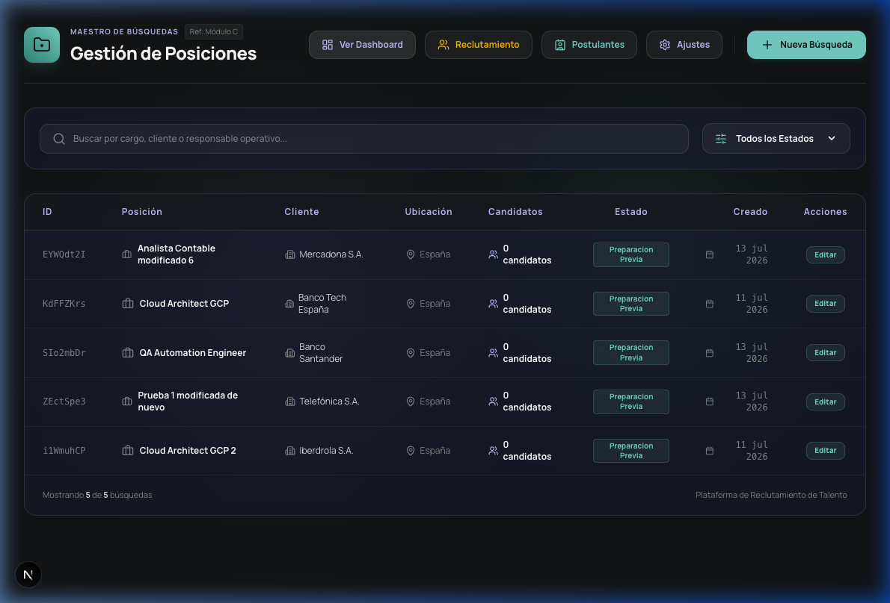

```
Ficha Técnica:
- Ruta: /busquedas
- Base de datos conectada: Google Cloud Run Server Action API (Firestore + BigQuery)
- Patrón UI: Tabla Dinámica Resiliente
```

### 💡 Descripción Funcional
El **Maestro de Búsquedas** es el inventario centralizado de las vacantes registradas en el sistema. Los reclutadores consultan, filtran y realizan la gestión integral de cada vacante técnica y administrativa.

### ✨ Características Clave
*   **Buscador Inteligente:** Barra interactiva que evalúa por texto libre el cargo, el cliente o el responsable asignado.
*   **Filtros de fase rápido:** Selector desplegable para filtrar registros basados en la fase actual de la vacante (`Preparación Previa`, `Evaluación Técnica`, `Revisión de Cliente`, `Oferta & Cierre`).
*   **Tabla de Datos Premium:** Filas hoverables que destacan el nombre de la posición, la empresa, y muestran el total de candidatos evaluados.
*   **Botón de Creación:** Acceso rápido para desplegar el formulario lateral de creación.

---

## 3.1 Slide-over de Alta y Edición de Búsquedas

### 📸 Imagen de Referencia: `busquedas_slideover.png`

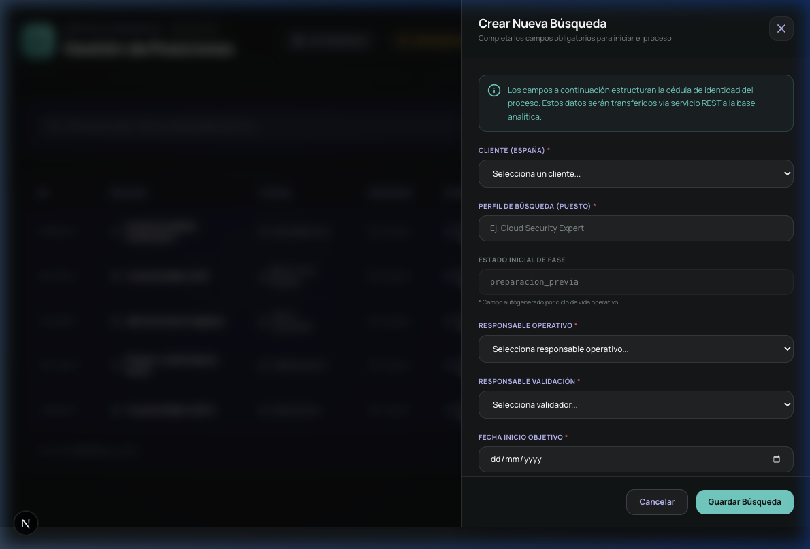

```
Ficha Técnica:
- Integración: SlideOver.tsx + SearchForm.tsx
- Conectividad API: POST y PATCH Server Actions en busquedas.ts
```

### 💡 Descripción Funcional
Al hacer clic en **"Nueva Búsqueda"** (o en **"Editar"** en cualquier fila de la tabla), se desliza lateralmente un panel sobre la tabla principal sin obligar al usuario a cambiar de página, lo que proporciona una experiencia de edición fluida e ininterrumpida.

### ✨ Características Clave
*   **Formulario de Alta (Cédula de Identidad):** Configuración de campos mandatorios: Cliente corporativo, Perfil Técnico, Estado de la Fase, Responsable Operativo, Responsable de Validación y Fecha Límite.
*   **Soporte de Estados de API (Doble Canal):** Captura estados de éxito 201 (Guardado completo) y 207 (Sincronización analítica parcial en BigQuery errónea pero guardado físico real en Firestore).

---

## 4. Módulo D: Recruitment Management (Tablero Kanban)

### 📸 Imagen de Referencia: `reclutamiento_page.png`

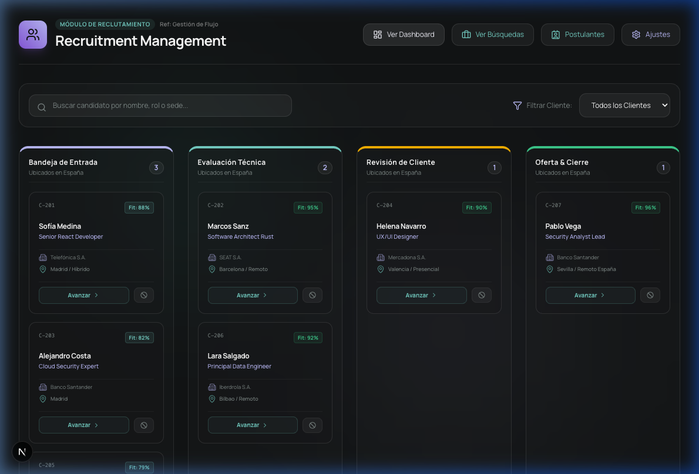

```
Ficha Técnica:
- Ruta: /reclutamiento
- Disposición visual: Tablero Kanban (Pipeline columnas)
```

### 💡 Descripción Funcional
El panel de **Recruitment Management** permite organizar de forma ágil la fase de cada candidato postulado a los procesos de selección activos, facilitando y agilizando las interacciones del reclutador en su rutina diaria.

### ✨ Características Clave
*   **Visualización en Columnas (Pipeline):** Cuatro columnas representando los estados secuenciales estándar:
    1.  *Bandeja de Entrada* (Screening inicial)
    2.  *Evaluación Técnica* (Codificación y entrevistas técnicas)
    3.  *Revisión de Cliente* (Evaluación de perfiles por parte del cliente contratante)
    4.  *Oferta & Cierre* (Negociación final de salarios y firma)
*   **Cédulas de Candidatos:** Cada ficha muestra información detallada, incluyendo el Fit Score (porcentaje de compatibilidad técnica), el puesto solicitado, cliente y ubicación geográfica.
*   **Acciones rápidas en Hover:** Botones integrados que permiten promover ("Avanzar") o descartar ("Rechazar") un perfil de inmediato.

---

## 5. Módulo E: Ajustes y Configuración del Sistema

### 📸 Imagen de Referencia: `configuracion_page.png`

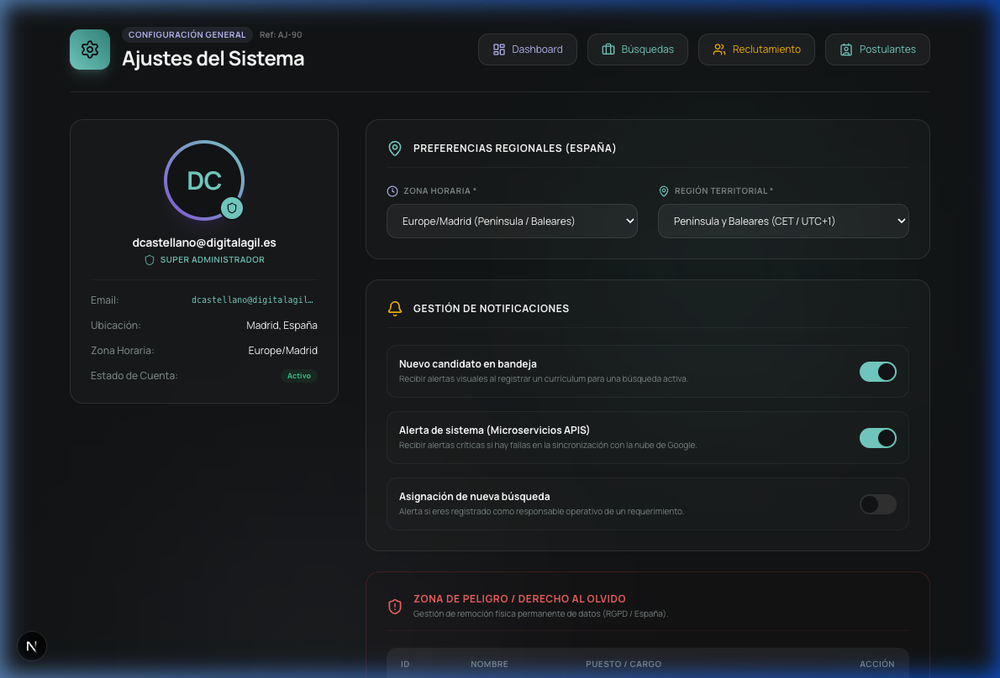

```
Ficha Técnica:
- Ruta: /configuracion
- Identidad: Super Administrador (Daniel Castellano)
```

### 💡 Descripción Funcional
Módulo centralizado para la administración de las credenciales del reclutador, zona horaria predeterminada de trabajo peninsular e insular en España, y la parametrización de alertas operacionales de los microservicios externos.

### ✨ Características Clave
*   **Tarjeta de Perfil Integrada:** Muestra los nombres, correo institucional (con soporte de enlace activo `mailto:`), rol del sistema y credenciales de acceso activas.
*   **Preferencias Regionales:** Selectores preconfigurados y focalizados al territorio español para la zona horaria (Península/Baleares y Canarias).
*   **Gestor de Notificaciones en Tiempo Real:** Interruptores dinámicos para habilitar o deshabilitar alertas sobre nuevos candidatos, notificaciones del sistema de APIs Firebase/Google Cloud Run, y procesos de asignación de vacantes.
*   **Zona de Peligro (Derecho al Olvido - RGPD):** Control especial restringido al rol de **Super Administrador**. Despliega un listado interactivo con el padrón local de candidatos registrados.
*   **Eliminación Física Definitiva (Hard Delete):** Permite invocar la purga definitiva de la base de datos de Firestore y los documentos asociados en Firebase Cloud Storage. El proceso cuenta con un modal interactivo de doble paso que describe el impacto legal del borrado físico según el reglamento de protección de datos RGPD y exige validar escribiendo en mayúsculas la palabra clave `CONFIRMAR`.
*   **Simulación de Guardado:** Botón interactivo que ejecuta animaciones de éxito y notifica la confirmación de la persistencia de datos.

---

## 6. Módulo F: Postulantes (Maestro y Registro de Candidatos)

### 📸 Imagen de Referencia: `postulantes_page.png`

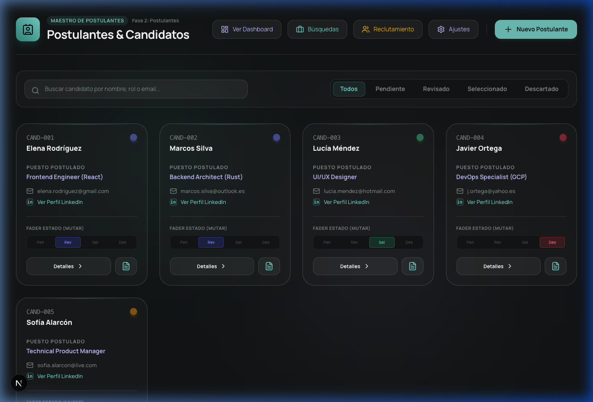

```
Ficha Técnica:
- Ruta: /talento
- Estilo Visual: Glassmorphism Grid de 4 columnas
- Conectividad: API REST Cloud Run Actions (candidatos.ts)
```

### 💡 Descripción Funcional
El módulo de **Postulantes** centraliza el ingreso y visualización de candidatos espontáneos del sistema. Permite a los reclutadores examinar de forma rápida los perfiles adjuntados por vías de entrada B2C, realizar búsquedas de texto en tiempo real y filtrar los currículums recibidos según la fase de evaluación.

### ✨ Características Clave
*   **Buscador Reactivo Integrado:** Barra de entrada en caliente que busca en tiempo real por el nombre del candidato, el cargo deseado o la dirección de email.
*   **Clasificador de Fases:** Botonera superior de filtrado rápido por estados (`Todos`, `Pendiente`, `Revisado`, `Seleccionado`, `Descartado`).
*   **Selector de Modo de Visualización (Tarjetas / Lista):** Botón selector (toggle) ubicado en la barra de controles que permite alternar la vista entre:
    *   **Vista de Tarjetas (Cards):** Grilla responsiva de tarjetas con fader integrado para mutar el estado y accesos de copia y detalles rápido.
    *   **Vista de Lista (List):** Tabla de datos moderna basada en glassmorphism que sintetiza el ID, Candidato (nombre y email), Puesto, Ubicación, Habilidades clave (badges dinámicos) y fecha de creación, con acciones directas para ver CV, copiar perfil y abrir el panel de detalles (`Detalle`). La preferencia de vista se almacena localmente en `localStorage`.
*   **Slide-over de Alta de Candidatos (Formulario):** Slide interactivo deslizable lateralmente para agregar un perfil manual:
    *   **Validación de Archivo CV:** Soporta Drag-and-Drop limitado exclusivamente a archivos `.pdf` con un tamaño máximo de `5MB`.
    *   **Consentimiento Legal Traceable:** Checkbox mandatorio (`acepta_privacidad`) para registrar la aceptación de términos de confidencialidad y RGPD.
    *   **Gestor de Fallos de Backend:** Cuadro de alerta roja animada para capturar e informar errores del tipo `400 Bad Request` devueltos por el servidor.

---

## 6.1 Ficha de Postulante y Consola DAW (Faders de IA)

### 📸 Imagen de Referencia: `candidato_detalle_page.png`

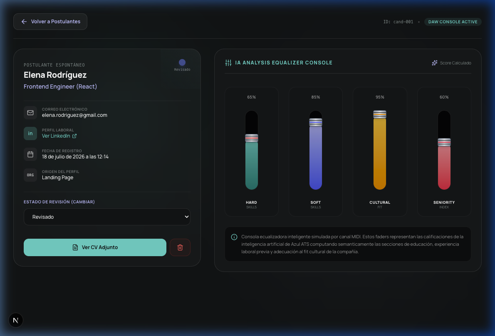

```
Ficha Técnica:
- Ruta: /talento/[id]
- Estilo Visual: Consola Mezcladora DAW (Digital Audio Workstation)
- Acceso: Clicando en "Detalles" desde la tarjeta del postulante
```

### 💡 Descripción Funcional
Muestra las calificaciones detalladas y perfil completo de un candidato específico mediante la metáfora visual premium de una consola de mezcla de audio DAW (faders MIDI de IA) combinada con una completa ficha técnica integral de habilidades, idiomas y contacto.

### ✨ Características Clave
*   **Botón Retorno ("Volver a Postulantes"):** Navegación fluida e integrada con animación hacia el listado principal `/talento`.
*   **Ficha de Contacto Enriquecida (Panel Izquierdo):**
    *   *Teléfono Móvil:* Muestra el número celular de contacto.
    *   *Ubicación:* Ubicación física o regional configurada.
*   **Panel Profesional e Idiomas (Panel Derecho):**
    *   *Habilidades Clave:* Badges tipo Pill interactivos generados de forma dinámica a partir de la lista provista en `skills_principales`.
    *   *Idiomas:* Tarjetas dedicadas para el nivel de inglés (`nivel_ingles`) y otros idiomas alternativos (`otros_idiomas`).
    *   *Anotaciones:* Contenedor estilo bloc de notas con soporte multilínea para comentarios iniciales de reclutamiento (`notas_iniciales`).
*   **Botón Copiar Resumen:** Botón interactivo que copia una ficha textual estructurada (incluyendo los nuevos datos de contacto, habilidades e idiomas) con un clic al portapapeles.
*   **Ecualizador de Calificaciones (Faders de IA):** Cuatro faders MIDI interactivos de volumen mezclador para visualizar de manera gráfica las métricas calculadas por inteligencia artificial (Hard Skills, Soft Skills, Fit Cultural, y Seniority Index).
*   **Acciones Directas:**
    *   *Ver CV Adjunto:* Botón interactivo para consultar el documento de currículum PDF persistido.
    *   *Descartar Postulante:* Botón de Soft Delete para cambiar de inmediato el estado del postulante a "Descartado" previniendo visualizaciones operativas ulteriores.
    *   *Modo Edición Interactivo:* Permite conmutar la ficha a modo de edición para actualizar en caliente los campos mutables: Nombre Completo, Email, LinkedIn, Teléfono Móvil, Ubicación, Habilidades Clave (entre 3 y 5 separadas por comas), Inglés, Otros Idiomas, y Anotaciones, mientras se resguarda la inmutabilidad de metadatos históricos.

---

## 7. Módulo G: F1 Descubrimiento (Tablero Kanban y Lista de Sourcing)

### 📸 Imagen de Referencia: `descubrimiento_lista.png`

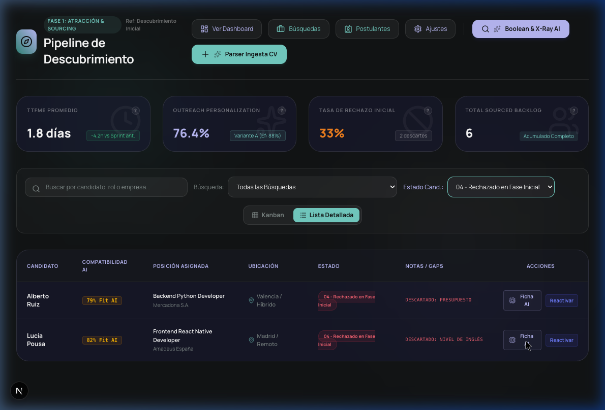

```
Ficha Técnica:
- Ruta: /descubrimiento
- Estilo Visual: Tablero Kanban (4 columnas glassmorphic) y Vista de Lista Alternable con filtros e indicadores de origen de consultas
- Conectividad: API de Google Gemini (1.5 Flash) + Fallback local base
```

### 💡 Descripción Funcional
El módulo de **F1 Descubrimiento** es el panel avanzado de atracción de talento que centraliza el pipeline de reclutamiento temprano, filtrado avanzado, maximizado completo y simuladores de sourcing asistidos por Inteligencia Artificial.

### ✨ Características Clave
*   **Tablero Kanban de Entrada:** Cuatro columnas para clasificar el estado operativo del talento:
    1. *01 - Nuevo (Para Revisión)*: Backlog de currículums entrantes listos para evaluar.
    2. *02 - Contactado (En Espera)*: Candidatos donde se inició el contacto inicial o triage.
    3. *03 - Bloqueado / Pendiente*: Candidatos con información faltante (e.g. CV legible, expectativa salarial).
    4. *04 - Rechazado (Fase Inicial)*: Perfiles que no superan el primer filtro técnico inicial.
*   **KPIs de Conversión Operacionales:** Indicadores superiores que informan la velocidad y calidad del sourcing: *TTFME* (Time to First Meaningful Engagement con fórmulas interactivas de cálculo en overlay manual `?`), índice de personalización A/B, tasa de rechazo temprano, y total volumétrico.
*   **Vista Alternativa de Lista y Ordenación:** Control para conmutar a vista de tabla glassmorphic con ordenación interactiva clickeable en todas las cabeceras (ascendente/descendente), y filtro lateral adicional por estado del candidato.
*   **Maximizado Total (Foco de Pantalla Completa):** Enlace en barra de filtros para ocultar cabeceras y KPI cards corporativas superiores, maximizando el panel de trabajo operativo del reclutador a pantalla completa.

---

## 7.1 Módulo G.1: Ficha de Candidato en F1 Descubrimiento y Motores de IA Google Gemini

### 📸 Imágenes de Referencia: `descubrimiento_detalle.png` y `descubrimiento_matching.png`

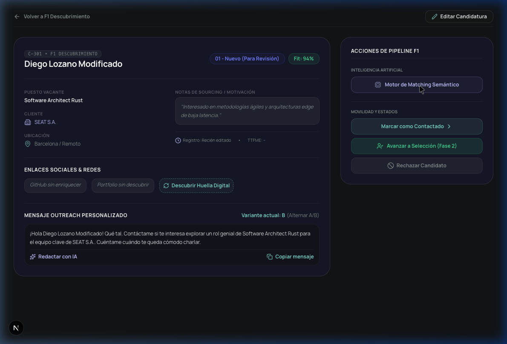
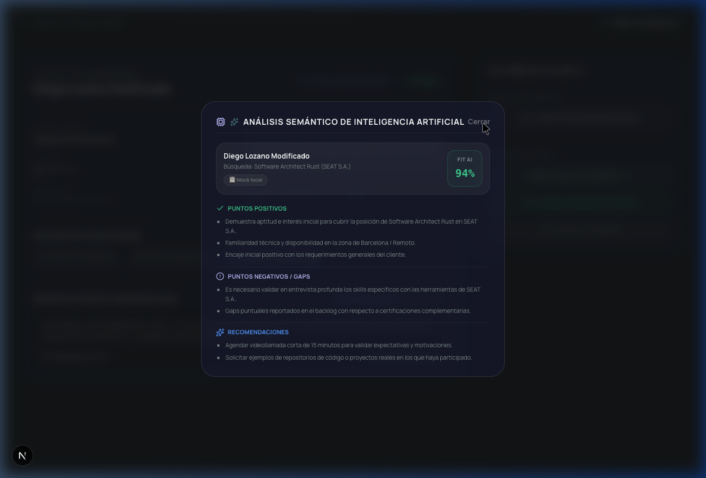

```
Ficha Técnica:
- Ruta: /descubrimiento/[id]
- Motores IA: Google Gemini 1.5 Flash (Semantic Analyzer + Outreach Writer + Query Builder)
- Acceso: Botón "Detalles" en tarjeta o lista
```

### 💡 Descripción Funcional
Permite ingresar a la visualización técnica del candidato reclutado en la fase de descubrimiento para editar sus datos, correr análisis semánticos detallados mediante LLM contra la vacante provista, y autogenerar plantillas de acercamiento eficaces.

### ✨ Características Clave
*   **Motor de Matching Semántico (Live vs Mock):** Analiza el perfil técnico del candidato contra la descripción de la vacante, entregando puntuaciones detalladas y listados de fortalezas, brechas, y recomendaciones para entrevistas. Muestra un badge de color distintivo indicando la fuente de los datos (`✨ GEMINI LIVE` si se conecta a la API o `📋 MOCK` local de fallback).
*   **Redacción de Outreach Automatizada con IA:** Redacta y reescribe dinámicamente mensajes de bienvenida adaptables según variantes A y B que extrae del perfil del candidato.
*   **Buscador Booleano y X-Ray AI:** Generador de strings avanzados de filtrado booleano y búsquedas X-Ray (LinkedIn / Google) con precarga de presets y simulación directa de importados al pipeline.
*   **Edición y Sincronización Local:** Formulario modal para actualizar en caliente datos operacionales del postulante, sincronizados de forma instantánea con el Kanban general a través de `localStorage`.
